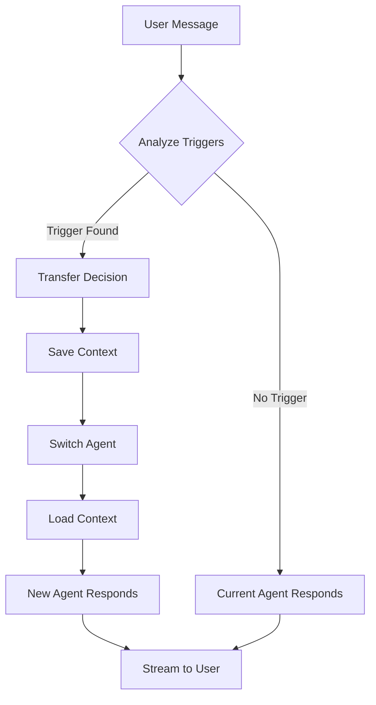

# RELATRIX Multi-Agent Orchestrator Architecture

## Overview

The Multi-Agent Orchestrator ("Dyrygent") is the core component of RELATRIX that manages the coordination between 7 specialized AI agents for relationship counseling. This architecture replaces the initial MCP Server approach, providing better streaming support, direct backend integration, and production-ready deployment.

## Why Orchestrator Instead of MCP?

1. **Streaming Support**: MCP's stdio transport doesn't support streaming responses, which is critical for chat UX
2. **Container Compatibility**: stdio transport exits immediately in containerized environments
3. **Direct Integration**: Orchestrator lives inside the backend, eliminating the need for inter-service communication
4. **Database-Driven**: Agents are loaded from database, not hardcoded
5. **Better Control**: Direct access to OpenAI streaming, Redis, and Mem0

## Architecture Components

### 1. Agent Registry
- Loads agents from Supabase database
- Caches agent configurations
- Manages agent lifecycle
- Handles hot-reloading of agent changes

### 2. Transfer Protocol Engine
- Analyzes user messages for transfer triggers
- Manages agent switching logic
- Maintains transfer history
- Ensures smooth context handoff

### 3. Memory Coordinator
- Integrates with Mem0 for long-term memory
- Uses Redis for session management
- Shares context between agents
- Maintains conversation continuity

### 4. Streaming Pipeline
- Direct OpenAI streaming integration
- Real-time response delivery
- Async processing for side effects
- Telemetry and monitoring

## Implementation Plan

### Phase 1: Core Orchestrator Module
```python
backend/
  app/
    orchestrator/
      __init__.py
      registry.py      # Agent registry and loader
      transfer.py      # Transfer protocol engine
      memory.py        # Memory coordination
      streaming.py     # Streaming response handler
      models.py        # Orchestrator data models
```

### Phase 2: Integration Points

1. **Chat API Integration**
   - Replace direct OpenAI calls with orchestrator
   - Add streaming response support
   - Implement transfer notifications

2. **Agent Management**
   - Dynamic agent reloading
   - Version tracking
   - A/B testing support

3. **Memory System**
   - Mem0 integration for user profiles
   - Redis for active sessions
   - Context window management

### Phase 3: Advanced Features

1. **Multi-Agent Conversations**
   - Parallel agent consultations
   - Agent collaboration protocols
   - Consensus mechanisms

2. **Learning & Adaptation**
   - Track successful transfers
   - Optimize trigger patterns
   - Personalize agent selection

## Agent Transfer Flow



## Data Models

### Agent Configuration
```python
class Agent:
    id: UUID
    slug: str
    name: str
    description: str
    system_prompt: str
    openai_model: str
    temperature: float
    max_tokens: int
    transfer_triggers: List[str]
    capabilities: List[str]
    is_active: bool
```

### Transfer Event
```python
class TransferEvent:
    timestamp: datetime
    from_agent: str
    to_agent: str
    trigger: str
    user_message: str
    context: Dict[str, Any]
```

### Session State
```python
class SessionState:
    session_id: str
    user_id: str
    current_agent: str
    conversation_history: List[Message]
    transfer_history: List[TransferEvent]
    memory_refs: List[str]
```

## API Endpoints

### Chat Endpoints
- `POST /api/chat/stream` - Streaming chat with orchestrator
- `GET /api/chat/session/{session_id}` - Get session state
- `POST /api/chat/transfer` - Manual agent transfer

### Orchestrator Management
- `GET /api/orchestrator/status` - Health and metrics
- `POST /api/orchestrator/reload` - Reload agents
- `GET /api/orchestrator/analytics` - Transfer analytics

## Migration Strategy

1. **Keep MCP Server Running** (temporary)
   - Continue serving existing functionality
   - No immediate disruption

2. **Build Orchestrator in Parallel**
   - Implement core modules
   - Test with subset of agents
   - Validate streaming performance

3. **Gradual Migration**
   - Route new sessions to orchestrator
   - Migrate active sessions carefully
   - Monitor performance metrics

4. **Deprecate MCP Server**
   - Once orchestrator is stable
   - All features migrated
   - Performance validated

## Benefits

1. **Better User Experience**
   - Instant streaming responses
   - Smooth agent transitions
   - No delays from inter-service calls

2. **Easier Deployment**
   - Single backend service
   - No stdio transport issues
   - Standard HTTP/WebSocket

3. **Enhanced Capabilities**
   - Direct memory access
   - Real-time telemetry
   - Advanced transfer logic

4. **Production Ready**
   - Database-driven configuration
   - Admin panel integration
   - Monitoring and analytics

## Next Steps

1. Create orchestrator module structure
2. Implement agent registry with database loader
3. Build transfer protocol engine
4. Integrate streaming pipeline
5. Update chat API to use orchestrator
6. Test and validate performance
7. Migrate from MCP server

## Timeline

- Week 1: Core orchestrator implementation
- Week 2: Integration and testing
- Week 3: Migration and monitoring
- Week 4: Deprecate MCP server

This architecture provides a robust, scalable foundation for RELATRIX's multi-agent system while maintaining all the benefits of the original design.